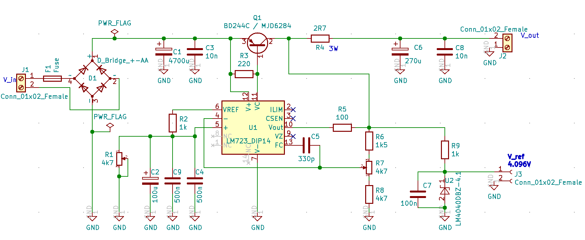

# Low noise power supply

Noise on the power lines is disturbing, especially when you have some RF 
components. Recently I got a hint to a work of Bernhard DG4RBF about his
paper on
[Rauschmessungen am LM723][].

Thanks to DF7KB and DC6CM for their helpful details and verifying the schema and the PCB,
which finally led to my KiCAD version using a LM723 and a PNP 
transistor BD244C.

The files in the kicad directoy are licensed under the terms of the definition
for Open Source Hardware Association.

It is a simple schema as screenshot from my KiCAD session:

You may want to have different Voltages, to get output lower than 7.15 V you need to
use R1. For output greater than 7.15 V R1 is not needed and output voltage is set with R7.

Have fun!

[Rauschmessungen am LM723]: https://dg4rbf.lima-city.de/Rauschmessungen%20am%20LM723.pdf
